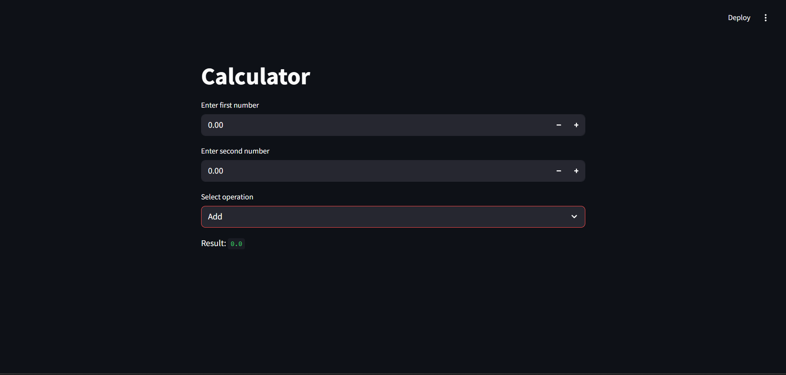

# 🧠 Terminal AI Coding Assistant 🚀

A terminal-native, full-stack development assistant powered by OpenAI's GPT-4o. It builds real applications from your natural language instructions — think of it as ChatGPT with sudo powers inside your terminal.


---

## ✨ What It Does

This assistant understands your plain English commands and transforms them into complete applications using a multi-step reasoning and execution framework.

### 🧑‍💻 Example:

**User:** Create a todo app in React

It will:

1. **Plan** the task (e.g., setup React, install dependencies, etc.)
2. **Execute** step-by-step using terminal commands and file creation
3. **Observe** the output of each command
4. **Repeat** until the task is complete
5. **Ask** for the next improvement or feature

---

## ⚙️ Features

✅ Full Chain-of-Thought Planning  
✅ Tool-Based Actions (`run_command`, `write_file`, `create_folder`, `run_server`)  
✅ JSON-Only Responses for Predictability  
✅ Supports Full App Generation & Iterative Edits  
✅ Auto-start Development Servers  
✅ GPT-4o Powered Conversations  

---

## 📁 Folder Structure

```
.
├── assistant.py
├── main.py
├── .env
├── README.md
├── banner.png
└── ss.png
```

---

## 🚀 Getting Started

### 1. Clone the repo

```bash
git clone https://github.com/Aryan-juneja/cursor-ai
cd terminal-ai-assistant
```

### 2. Install dependencies

```bash
pip install openai python-dotenv
```

### 3. Set up environment

Create a `.env` file with your OpenAI API Key:

```env
OPENAI_API_KEY=your_api_key_here
```

### 4. Run the assistant

```bash
python main.py
```

---

## 📦 Available Tools

| Tool Name | Description |
|-----------|-------------|
| `run_command` | Execute shell commands like `npm install`, `pip install`, `ls`, etc. |
| `create_folder` | Create folders/directories |
| `write_file` | Write code into files |
| `run_server` | Launch development servers like `npm start`, `flask run`, etc. |

---

## 📌 Built With

🧠 **OpenAI GPT-4o**  
🐍 **Python 3**  
🌱 **Dotenv**  
🔁 **Subprocess**  

---

## 🖼️ Demo

Here's an example of creating a functional calculator in Streamlit:



*The assistant successfully created a fully functional calculator app in Streamlit based on a simple natural language request.*

---

## 🧩 Use Cases

- Scaffolding React, Flask, or Streamlit apps in seconds
- Modifying and expanding existing codebases
- Building your side-projects without switching tabs
- Developer copilots, LLM-agents, DevOps assistants

---

## 🗣️ Contribute

Got ideas or want to extend tool capabilities (e.g., file reading, diffing, etc.)? Pull requests and issues welcome!

---

## 📄 License

MIT License - feel free to use this project for your own development needs.

---

## 🔗 Links

- [GitHub Repository](https://github.com/Aryan-juneja/cursor-ai)
- [OpenAI API Documentation](https://platform.openai.com/docs